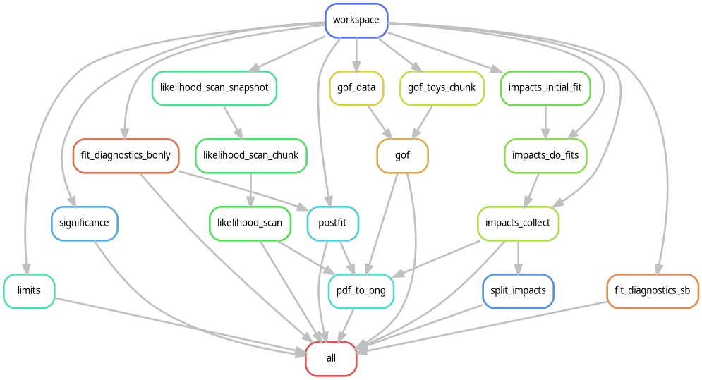

# Statistical Analysis Combine Snakemake Workflow

This directory contains the central Snakemake workflow (`combine.smk`) and helper utilities for running statistical analysis (limits, significance, goodness-of-fit, and nuisance impacts) using the CMS CombinedLimit tool.

## Execution Modes

There are two primary ways to run this workflow:

### 1. Direct Execution
Run Snakemake directly on the `combine.smk` file by passing your custom configuration YAML file. This mode generates and runs the entire standard analysis DAG automatically.

```bash
./run_container snakemake \
    --snakefile src/stat_analysis/combine.smk \
    --configfile path/to/your_config.yml \
    --cores 4
```

To preview the execution plan (dry-run):
```bash
./run_container snakemake \
    --snakefile src/stat_analysis/combine.smk \
    --configfile path/to/your_config.yml \
    -n
```

### 2. Modular Inclusion
Import the module into your custom analysis pipeline's Snakefile. This allows you to selectively instantiate, customize, and chain the rules:

```python
module combine:
    snakefile: "src/stat_analysis/combine.smk"
    config: config

# Example: Custom instantiation of the workspace rule
use rule workspace from combine with:
    input: "path/to/datacard.txt"
    output: "path/to/workspace.root"
```

---

## Example Configuration File

Save a file as `your_config.yml` (e.g. under `config/stats/`):

```yaml
# Output directory base path
output_path: "output/v4_systematics_test/HH4b/"

# Bypass impacts and GoF fits (run only limits/significance/scans)
stat_only: false

# Mass parameter passed to Combine commands
mass: "125"

# Likelihood scan settings
likelihood_scan_points: 50
likelihood_scan_split_size: 10

# Goodness of Fit settings
gof_algo: "saturated"
num_toy_jobs: 10
toys_per_job: 50

# Channel definitions mapping signals
channels:
  HH4b:
    signallabel: "ggHH_kl_1_kt_1_13p0TeV_hbbhbb"
    othersignal: "ggHH_kl_0_kt_1_13p0TeV_hbbhbb ggHH_kl_2p45_kt_1_13p0TeV_hbbhbb ggHH_kl_5_kt_1_13p0TeV_hbbhbb"
    signal: "GluGluToHHTo4B_cHHH1"
```

---

## Configuration Settings Summary

| Parameter | Type | Default | Description |
|-----------|------|---------|-------------|
| `stat_only` | `bool` | `False` | When `True`, automatically bypasses time-consuming Goodness-of-Fit (GoF) and Systematic Impacts fits. |
| `output_path` | `str` | `output/v4_systematics_test/HH4b/` | Base directory path where limits, scans, and fits will be output. |
| `channels` | `dict` | `{}` | A dictionary defining signals and channels. |

---

## Rule Parallelization Details

To optimize CPU utilization, the fits have been parallelized to run concurrently across HTCondor slots:
- **Fit Diagnostics** is split into parallel B-only (`fit_diagnostics_bonly`) and S+B (`fit_diagnostics_sb`) fit rules.
- **Impacts** is split into `impacts_initial_fit` (initial fit), `impacts_do_fits` (systematic fits run in parallel on HTCondor), and `impacts_collect` (a localrule that merges fits and plots the final PDF).

---

## Rule Graph

Below is the dependency graph of the workflow rules:


